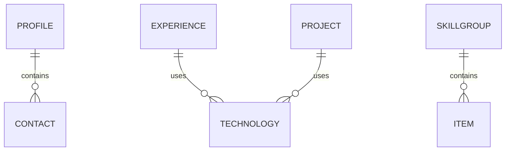

# PRD — Персональный сайт-визитка «Mars CV» на Blazor

> Версия: 1.0 · Дата: 2026-09-24 · Автор концепции: владелец проекта · Формат: Product Requirements Document для передачи разработчикам (человеку или AI)

---

## 1. Обзор приложения и цели

### 1.1 Краткое описание
Одностраничный сайт-визитка (single-page application, SPA) на **Blazor WebAssembly**, объединяющий **продающий лендинг** и **резюме (CV)** в одной упаковке. Основной источник трафика — **прямая ссылка со страницы hh.ru**; сайт служит «усилителем» резюме, показывая глубину и уровень специалиста визуально.

### 1.2 Проблема
На сайтах поиска работы (hh.ru и др.) ограниченный формат резюме: нельзя развёрнуто и визуально выразительно показать весь опыт, достижения и уровень. HR тратит секунды на оценку профиля и часто не дочитывает.

### 1.3 Цель продукта
Убедить HR и потенциальных заказчиков, что владелец — **очень хороший специалист**, за счёт стильной, минималистичной и быстрой подачи опыта.

### 1.4 Ключевые метрики успеха (business outcomes)
- Приглашения на собеседования и заказы, полученные по ссылке с сайта.
- Быстрый отклик страницы и корректное превью ссылки в Telegram/hh (влияет на доверие и кликабельность).

### 1.5 Не-цели (out of scope v1)
- Блог, статьи, лента новостей.
- Мультиязычность (EN) — пока только русский.
- Личный кабинет, аутентификация, база данных.
- Форма обратной связи и PDF-версия CV.
- Счётчики аналитики.

---

## 2. Целевая аудитория

| Сегмент | Доля трафика (ожид.) | Что важно для него |
|---|---|---|
| **HR / рекрутеры** | Основной | Быстро считать уровень за 5 секунд; «очеловеченный» образ; надёжность (сайт открылся, ссылка развернулась) |
| **Технические интервьюеры / lead'ы** | Вторичный | Конкретика: стек, достижения с цифрами, глубина задач |
| **Потенциальные заказчики (frilance)** | Вторичный | Понять компетенции и как связаться |

**Основной сценарий:** HR открывает ссылку из hh → видит Hero с фото, ролью и оффером → скроллит по «полный опыт ниже» → раскрывает карточки → читает пет-проекты → переходит в контакты (Telegram / hh / email).

---

## 3. Основные функции и функциональность

### 3.1 Структура страницы (порядок блоков)
`Hero → Обо мне → Таймлайн опыта → Навыки → Pet-проекты → Контакты`

### 3.2 Функция: Hero (первый экран)
**Описание.** Первый экран без прокрутки: фото, имя, роль, оффер и указатель на продолжение.

**Состав:**
- Фото владельца.
- Имя.
- Роль (например, «Senior .NET Developer»).
- Оффер — одна сильная строка-крючок о том, какую пользу приносит владелец (не просто «я разработчик»).
- Указатель вниз: «Подробнее» (стрелка / скролл-хинт).

**Acceptance criteria:**
- На экране 360×640 и выше всё видно без прокрутки (фото + имя + роль + оффер).
- Присутствует явный визуальный элемент, подсказывающий скролл.
- Ссылка на hh.ru доступна с первого экрана (основной источник трафика).

**Technical considerations:**
- Фото — изображение в формате WebP/AVIF, оптимизированное (целевой вес ≤ 150 КБ).
- Оффер и имя берутся из `profile.json`.

---

### 3.3 Функция: «Обо мне»
**Описание.** Короткий блок (2–3 предложения) человеческим языком между Hero и опытом — «очеловечивает» профиль.

**Acceptance criteria:**
- Отображается 1–3 абзаца из `profile.json` (поле `about`).
- Текст читается на мобильных без горизонтального скролла.

---

### 3.4 Функция: Таймлайн опыта (интерактивный)
**Описание.** Вертикальный таймлайн по местам работы. В свёрнутом виде — компактная карточка (компания, роль, период, краткое описание). По клику карточка раскрывается и показывает подробности: что делал, как делал, достижения, стек.

**Состав свёрнутой карточки:** компания, роль, период (`MM.YYYY – MM.YYYY` / «наст. время»), краткое резюме (1–2 строки).
**Состав раскрытой карточки:** развёрнутое описание (абзацы), список достижений (с цифрами, где возможно), список технологий (показывается внутри карточки — **отдельного блока со стеком нет**).

**Acceptance criteria:**
- Таймлайн отсортирован от свежих мест работы к более ранним (свежее — наверху, чем ниже — тем раньше по времени). HR в первую очередь интересно последнее место.
- Последняя (самая свежая) запись визуально акцентируется (выделенный маркер / акцентный цвет), чтобы взгляд цеплялся за неё первым.
- Клик по карточке раскрывает подробности; одновременно раскрыта **только одна карточка** (аккордеон: открытие новой закрывает предыдущую).
- Последнее место работы (самая свежая запись) раскрыто по умолчанию.
- Раскрытие/скрытие работает с клавиатуры (Enter/Space) и озвучивается скринридером (ARIA).
- Анимация раскрытия плавная и не блокирует интерфейс.

**Technical considerations:**
- Реализация — аккордеон: компонент `ExperienceTimeline.razor` + `ExperienceItemCard.razor`.
- Данные — из `experience.json`; стек хранится в поле `technologies` каждой записи.

---

### 3.5 Функция: Pet-проекты / чем занимаюсь в свободное время
**Описание.** Отдельный блок, показывающий инициативу и увлечённость. Карточки проектов.

**Состав карточки:** название, краткое описание, технологии, опционально ссылка на репозиторий и/или демо.

**Acceptance criteria:**
- Отображаются все проекты из `projects.json`.
- Ссылки (если есть) открываются в новой вкладке с `rel="noopener noreferrer"`.
- Сетка карточек адаптивна (1 колонка на мобильных, 2–3 на десктопе).

---

### 3.6 Функция: Контакты
**Описание.** Финальный блок с прямыми контактами.

**Состав:** Telegram, hh.ru, email.

**Acceptance criteria:**
- Все три контакта присутствуют и кликабельны (tel/mailto/URL).
- Ссылка на Telegram открывается корректно (`https://t.me/...`).
- Email защищён от простых спам-ботов (см. §7).

**Не делаем:** форму обратной связи, кнопку скачать PDF (вместо неё ведём на страницу hh).

---

### 3.7 Функция: Марсианская тема оформления
**Описание.** Визуальный концепт: ржаво-красная палитра, пыльная атмосфера, отсылки к снимкам марсохода Curiosity. «Комбо»-подход: один лёгкий реальный снимок Марса в Hero + лёгкие CSS-эффекты дальше (частицы «пыли», параллакс, свечения).

**Acceptance criteria:**
- Палитра и стиль выдержаны единообразно на всех блоках.
- Используется не более 1 тяжёлого изображения (Hero), оптимизированного до WebP/AVIF.
- Есть элегантный фоллбэк: при отключённых анимациях/медленном устройстве контент полностью читаем (см. `prefers-reduced-motion`).
- Визуал сохраняет минимализм: воздух, читаемость, один-два акцентных цвета.

**Technical considerations:**
- Источник снимка — NASA (снимки Curiosity, как правило, public domain); проверить условия использования конкретного кадра.
- Если визуально «не зайдёт» — откат к абстрактной теме (градиенты + процедурный шум/частицы без реальных фото).

---

### 3.8 Функция: Анимации и адаптивность
**Описание.** Плавные анимации появления блоков при скролле, hover-эффекты; полная адаптация под мобильные.

**Acceptance criteria:**
- Анимации запускаются при попадании элемента в viewport (IntersectionObserver) и не вызывают «дёрганья».
- При `prefers-reduced-motion: reduce` анимации отключаются.
- Вёрстка корректна на ширинах 360, 768, 1024, 1440 px.
- Нет горизонтального скролла на мобильных.
- Целевые показатели производительности: LCP ≤ 2.5 c, CLS ≤ 0.1 на мобильной сети (Lighthouse).

---

### 3.9 Функция: OpenGraph/SEO-метаданные (превью ссылки)
**Описание.** Ссылка, отправленная в Telegram или размещённая на hh.ru, должна красиво разворачиваться (заголовок, описание, картинка). Так как Blazor WASM — SPA, мета-теги прописываются **статически в `wwwroot/index.html`**.

**Acceptance criteria:**
- В `index.html` заданы: `<html lang="ru">`, `<title>`, `meta description`, OpenGraph (`og:title`, `og:description`, `og:image`, `og:url`, `og:type`), Twitter Card.
- `og:image` — оптимизированное изображение-превью (рекомендуется 1200×630).
- При отправке ссылки в Telegram превью отображается с картинкой, заголовком и описанием.

---

## 4. Рекомендации по техническому стеку

### 4.1 Итоговая рекомендация

| Слой | Рекомендация | Обоснование |
|---|---|---|
| Платформа | **Blazor WebAssembly (standalone)** | Чистая статика → бесплатный хостинг; владелец — .NET-разработчик |
| Версия | **.NET 10 LTS** | Актуальный LTS: стабильность и поддержка |
| Язык | C# | Профиль владельца |
| Рендеринг контента | JSON + C#-сервис | Гибко правится без изменения кода (выбор владельца) |
| Стили | **Кастомный CSS** с CSS-переменными | Полный контроль для уникальной Mars-темы; без лишнего тулинга; на скорость загрузки не влияет |
| Анимации | CSS transitions + `IntersectionObserver` (небольшой JS-interop) | Легко и производительно, без тяжёлых библиотек |
| Изображения | WebP/AVIF, оптимизация | Быстрая загрузка |
| Хостинг | **Отложено — ожидается одобрение заявки на Azure Static Web Apps.** Если не одобрят — выбрать провайдера с **наилучшей доступностью** (Yandex Cloud Object Storage / Cloudflare Pages и др.) | Стартуем **локально**, хостинг подключаем позже; максимальная экономия |
| Домен | **Не покупаем**; бесплатный поддомен хостинга | Максимальная экономия (домен позднее) |
| Аналитика | Не используется | По решению владельца |

### 4.2 Рассмотренные альтернативы
- **Blazor Server** — отклонён: требует постоянного серверного процесса и SignalR-соединения → платный хостинг и «засыпание» при простое. Против цели «не тратиться».
- **Static SSR (.NET 8+ Blazor Web App)** — отклонён для v1: требует серверного рантайма при запросе, что усложняет бесплатный статический хостинг.
- **GH Pages / Netlify / Vercel** — допустимые альтернативы фоллбэка; GH Pages требует обхода SPA-роутинга (404-хак), Netlify/Vercel проще, но доступность из РФ стоит проверить.

### 4.3 Границы применимости рекомендаций
Выбор хостинга **отложен**: владелец ожидает одобрения заявки на Azure Static Web Apps. Если заявку не одобрят — выбирается провайдер с **наилучшей доступностью** (приоритет — доступ из РФ). Разработка стартует **локально**, хостинг подключается позже. Проект должен собираться как **портативная статика** (`dotnet publish -c Release` → папка `wwwroot`), которую можно разложить в любой S3-совместимый бакет или на статический хостинг без изменений кода.

> Примечание: специализированные инструменты исследования (Brave/Tavily) в текущей среде недоступны, поэтому рекомендации даны на основе существующих знаний. Перед фиксацией выбора Azure SWA и бесплатных тарифов hостингов стоит сверить актуальные условия и цены на официальных сайтах.

---

## 5. Концептуальная модель данных

Данные хранятся в JSON-файлах в репозитории, публикуются в `wwwroot/content/` и загружаются во время выполнения через `HttpClient` (либо как embedded resources). C#-модели 1:1 соответствуют структуре JSON.

### 5.1 `wwwroot/content/profile.json`
```jsonc
{
  "name": "string",              // Имя владельца
  "role": "string",              // Роль, напр. "Senior .NET Developer"
  "offer": "string",             // Строка-крючок для Hero
  "photoUrl": "string",          // Путь к фото, напр. "/img/profile.webp"
  "about": ["string", "..."],    // 1–3 абзаца
  "contacts": [
    {
      "type": "telegram",        // "telegram" | "hh" | "email"
      "label": "string",         // Подпись на кнопке
      "url": "string",           // https://t.me/... | https://hh.ru/... | mailto:...
      "icon": "string"           // Идентификатор иконки
    }
  ]
}
```

### 5.2 `wwwroot/content/experience.json`
```jsonc
[
  {
    "id": "string",              // Уникальный идентификатор
    "company": "string",
    "role": "string",
    "startDate": "YYYY-MM",      // Для сортировки и отображения
    "endDate": "YYYY-MM | null", // null = "по настоящее время"
    "location": "string | null",
    "summary": "string",         // 1–2 строки для свёрнутой карточки
    "details": ["string", "..."],// Абзацы для раскрытой карточки
    "achievements": ["string"],  // Пункты достижений (желательно с цифрами)
    "technologies": ["string"]   // Стек внутри карточки (отдельного блока стека нет)
  }
]
```

### 5.3 `wwwroot/content/projects.json`
```jsonc
[
  {
    "id": "string",
    "title": "string",
    "description": "string",
    "technologies": ["string"],
    "repoUrl": "string | null",
    "demoUrl": "string | null",
    "imageUrl": "string | null"
  }
]
```

### 5.4 `wwwroot/content/skills.json`
```jsonc
[
  {
    "id": "string",              // Уникальный идентификатор группы
    "title": "string",           // Название группы, напр. "Backend / .NET", "Android", "AI / ML"
    "description": "string",     // Краткое описание группы
    "items": ["string", "..."]   // Список навыков/технологий в группе
  }
]
```

### 5.5 Диаграмма связей

- `PROFILE` — одна запись на сайт.
- `EXPERIENCE` — список (0..N) мест работы, сортируется по `startDate` (убывание).
- `PROJECT` — список (0..N) пет-проектов.
- `SKILLGROUP` — список (0..N) групп навыков (Backend/.NET, Android, AI и др.).
- `CONTACT` — 3 фиксированных типа: telegram, hh, email.

### 5.6 Сопоставление моделей и компонентов (терминология)
| Модель | Компонент (Razor) |
|---|---|
| `Profile` | `HeroSection.razor`, `AboutSection.razor`, `ContactSection.razor` |
| `ExperienceItem` | `ExperienceTimeline.razor`, `ExperienceItemCard.razor` |
| `SkillGroup` | `SkillsSection.razor` |
| `Project` | `ProjectsSection.razor`, `ProjectCard.razor` |
| — | `ContentService.cs` (загрузка и кэширование JSON) |
| — | `MarsBackground.razor` (пыль/частицы/параллакс) |

---

## 6. Принципы UI-дизайна

### 6.1 Дизайн-язык
- **Марсианская тема**: ржаво-красные, терракотовые, пыльно-оранжевые оттенки; тёмный фон; тёплые акценты.
- **Минимализм**: много воздуха, крупная типографика, ограниченная палитра (1 фон + 1–2 акцента + нейтральный текст).
- **Ощущение «дорогого» специалиста**: аккуратные отступы, консистентные радиусы и тени, плавные микроанимации.

### 6.2 Палитра (пример-ориентир, финально утверждается визуально)
- Фон: тёмный угольно-коричневый/«марсианская ночь».
- Акцент: ржаво-красный / пыльно-оранжевый.
- Доп. акцент (для ссылок/CTA): тёплый песочный или приглушённый бирюзовый для контраста.
- Текст: тёплый светлый на тёмном фоне (проверить контраст ≥ 4.5:1).

### 6.3 Типографика
- Крупные заголовки, читаемый основной текст; системные шрифты или 1 оптимизированный вариативный шрифт.
- Иерархия: H1 (имя/оффер), H2 (заголовки секций), body.

### 6.4 Wireframe (низкоуровневый, ASCII)
```
┌───────────────────────────────────────┐
│ [фото]  ИМЯ                            │
│         Senior .NET Developer          │
│         «Оффер-крючок...»              │
│         ↓ Подробнее                    │
├───────────────────────────────────────┤
│ Обо мне                                │
│ 2–3 предложения человеческим языком    │
├───────────────────────────────────────┤
│ Опыт                                   │
│ ● Компания A · Role · 2022–наст.  [+]  │
│ ● Компания B · Role · 2019–2022   [+]  │
│ ● Компания C · Role · 2017–2019   [+]  │
├───────────────────────────────────────┤
│ Навыки                                 │
│ [ Backend/.NET ] [ Android ] [ AI ]    │
├───────────────────────────────────────┤
│ Pet-проекты                            │
│ [ Карточка ] [ Карточка ] [ Карточка ] │
├───────────────────────────────────────┤
│ Контакты:  Telegram · hh.ru · Email    │
└───────────────────────────────────────┘
```

### 6.5 Поведение и доступность
- Фокус-состояния для интерактивных элементов таймлайна и ссылок.
- Семантические заголовки, alt-текст для изображений.
- Поддержка `prefers-reduced-motion`.
- Контраст текста и фона соответствует WCAG AA.

---

## 7. Соображения по безопасности

Сайт **полностью статический**, без сервера, без БД, без пользовательских данных и аутентификации — поверхность атак минимальна.

- **HTTPS** обеспечивается хостингом (Azure SWA / Cloudflare / Yandex — из коробки).
- **Внешние ссылки**: всегда `target="_blank"` + `rel="noopener noreferrer"`.
- **Защита email от спам-ботов**: обфускация (сборка адреса в JS/через Blazor, либо `mailto` с заменой символов), не хранить email как простой текст в HTML.
- **Секреты**: в проекте не должно быть API-ключей и токенов; если появятся — только через переменные окружения CI, не в репозитории.
- **Content Security Policy (CSP)**: по возможности задать базовую CSP-мета-политику в `index.html` (ограничение источников скриптов/изображений).

---

## 8. Этапы разработки / milestones

| Milestone | Содержание | Результат (Definition of Done) |
|---|---|---|
| **M0. Каркас (локально)** | Создать Blazor WASM проект, статический `index.html` (lang=ru, OG-теги), запуск локально | Сайт-заглушка работает локально; подготовлен портативный `wwwroot` |
| **M0b. Деплой (после одобрения хостинга)** | Подключить выбранный хостинг + CI | Сайт доступен по URL, превью ссылки в Telegram корректное |
| **M1. Слой контента** | C#-модели (`Profile`, `ExperienceItem`, `Project`, `ContactLink`), `ContentService`, JSON-файлы с плейсхолдерами | Данные из JSON загружаются и логируются; модели покрыты базовой проверкой |
| **M2. Hero + Обо мне** | Mars-тема: палитра, шрифты, фон, Hero и блок «Обо мне» | Первый экран соответствует acceptance criteria §3.2–3.3 |
| **M3. Таймлайн опыта** | Аккордеон-таймлайн, доступность, стек внутри карточек | §3.4 AC выполнены |
| **M4. Pet-проекты + Контакты** | Карточки проектов, блок контактов, защита email | §3.5–3.6 AC выполнены |
| **M5. Анимации, адаптив, производительность** | Scroll-анимации, `prefers-reduced-motion`, мобильная вёрстка, оптимизация изображений | Lighthouse: LCP ≤ 2.5 c, CLS ≤ 0.1; нет горизонтального скролла |
| **M6. Полировка и запуск** | Финальная вычитка контента владельцем, проверка OG-превью, деплой на основной хостинг + проверка фоллбэка | Ссылка готова к размещению на hh.ru |

### Порядок по спринтам (логическая группировка)
- Спринт 1: M0–M1 (инфраструктура + данные).
- Спринт 2: M2–M3 (ядро контента страницы).
- Спринт 3: M4–M5 (остальные блоки + качество).
- Спринт 4: M6 (запуск).

---

## 9. Потенциальные проблемы и способы их решения

| # | Проблема | Влияние | Решение |
|---|---|---|---|
| 1 | **Размер загрузки Blazor WASM** (~1.5–2 МБ рантайм) | Долгий первый рендер, против цели «быстро грузилось» | Включить trimming + Brotli/gzip; ленивую загрузку; при необходимости AOT; показать лёгкий HTML-«скелет» до гидратации |
| 2 | **SEO/индексация SPA** | Плохая видимость в поиске | Не критично (трафик прямой с hh); вынести ключевые мета-теги статически в `index.html` |
| 3 | **Превью ссылки (OG) в Telegram/hh** | Ссылка выглядит «пустой» → падает доверие | Статические OG-теги + картинка-превью 1200×630 (§3.9) |
| 4 | **SPA-роутинг на статическом хостинге** | 404 при прямом заходе на «внутренний» маршрут | Azure SWA обрабатывает fallback автоматически; для GH Pages — трюк с `404.html` |
| 5 | **Доступность хостинга из РФ** | HR из РФ не откроет сайт | Фоллбэк Yandex Cloud Object Storage / Cloudflare Pages; проверять доступность на каждом релизе |
| 6 | **Вес изображений и шрифтов** | Медленная загрузка | WebP/AVIF, ≤1 тяжёлого изображения, lazy-loading, ограниченный набор шрифтов |
| 7 | **Mars-тема не «зайдёт» визуально** | Дизайн не убеждает | Заранее предусмотрен откат к абстрактной теме (градиенты + процедурные эффекты) |
| 8 | **Производительность анимаций на слабых устройствах** | Дёрганье, расход батареи | Использовать CSS-трансформации (transform/opacity), `IntersectionObserver`, отключение при `prefers-reduced-motion` |
| 9 | **Устаревание/доступность NASA-снимка** | Юридические/технические риски | Проверить лицензию (public domain обычно), хранить локальную оптимизированную копию в репозитории |
| 10 | **Актуальность бесплатных тарифов хостинга** | Внезапные ограничения | Портативная статика (`wwwroot`) → быстрая миграция между провайдерами |

---

## 10. Возможности будущего расширения

- **Свой домен** (после трудоустройства) — упрощает брендинг и миграции.
- **Локаль EN** — расширение на зарубежные вакансии.
- **PDF-версия CV** для рекрутёров по запросу.
- **Форма обратной связи** (потребует бэкенд/serverless-функцию).
- **Блог / заметки** о .NET и разработке — усиливает экспертность и SEO.
- **Переключатель dark/light** или дополнительные визуальные темы.
- **Лёгкая аналитика** (Яндекс.Метрика) — если появится интерес к воронке.
- **Микроанимации уровня «wow»** (WebGL/Canvas сцена Марса) при сохранении бюджета производительности.

---

## 11. Вопросы для уточнения (открытые)

1. Хостинг — **ожидается одобрение заявки на Azure Static Web Apps**. Если не одобрят — хостимся у провайдера с лучшей доступностью. До этого — разработка локально.
2. Финальный набор контактных иконок и порядок (Telegram / hh / email) — какой приоритет отображения?
3. Ссылка на hh.ru — на **профиль** или на **скачиваемое резюме**?
4. Заполнение реальным контентом: сколько мест работы и пет-проектов войдут в v1 (для оценки объёма текста)?

---

## 12. TODO / Открытые задачи

- [ ] **Хостинг:** дождаться решения по заявке на **Azure Static Web Apps**.
  - Если одобрят → подключить Azure SWA.
  - Если не одобрят → выбрать провайдера с **наилучшей доступностью** (кандидаты: Yandex Cloud Object Storage, Cloudflare Pages).
- [ ] **Старт локально:** развернуть Blazor WASM (.NET 10 LTS) и запускать разработку локально до подключения хостинга.
- [ ] Подготовить проект как портативную статику (`dotnet publish -c Release` → `wwwroot`) для быстрой миграции между провайдерами.
- [x] ~~Выбрать стиль стилей~~ → **кастомный CSS** (решено).
- [x] ~~Определить поведение таймлайна~~ → **одна карточка за раз** (решено).
- [ ] Собрать реальный контент: места работы, достижения, стек, пет-проекты.
